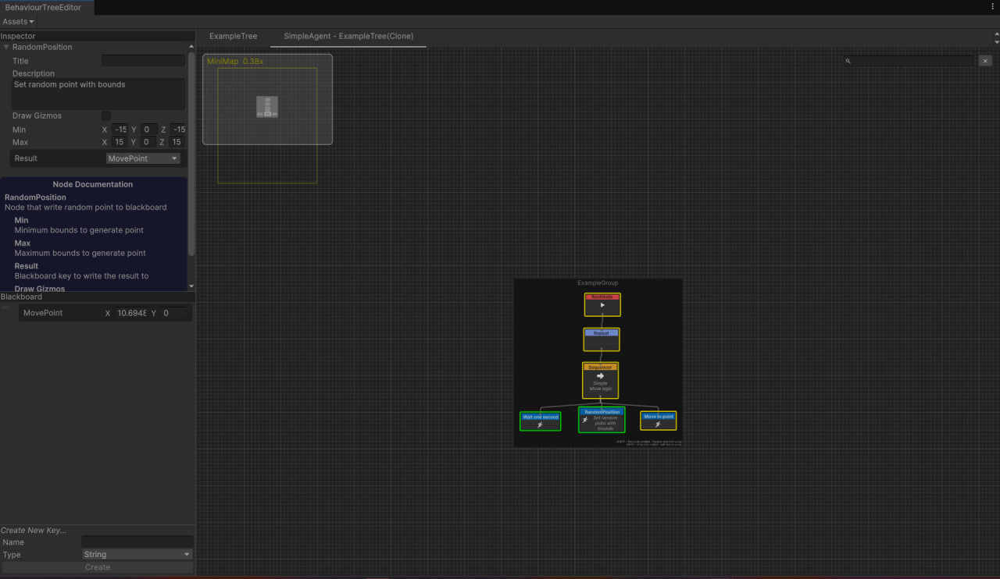

 
 
 
 
 
 
 
 
    <h1>Behaviour Tree Node Editor</h1>
    

Данное решение позволяет без особых усилий делать комплексную логику для ваших NPC

Из основных фичей:
- Само ядро нодового редактора
- Возможность делать локальную документацию отметив нужные ноды атрибутом [BTHelp]
- Функционал валидации самих нод в Editor части
- Полноценный поиск нод по типам, Description'у, по Title и по группе в которой находится сами ноды
- Полноценный механизм Undo/Redo
- Возможность просматривать состояния нод в PlayMode у конкретного дерева
- гибкая система Blackboard значений
- Адаптивный BehaviourTreeContext внутри которого можно забиндить разного рода сервисы для удобной работы внутри логики BehaviourTree
- Приятный UX
- Utility выборка нод по весам
Его можно взять за основу для любого рода проекта
